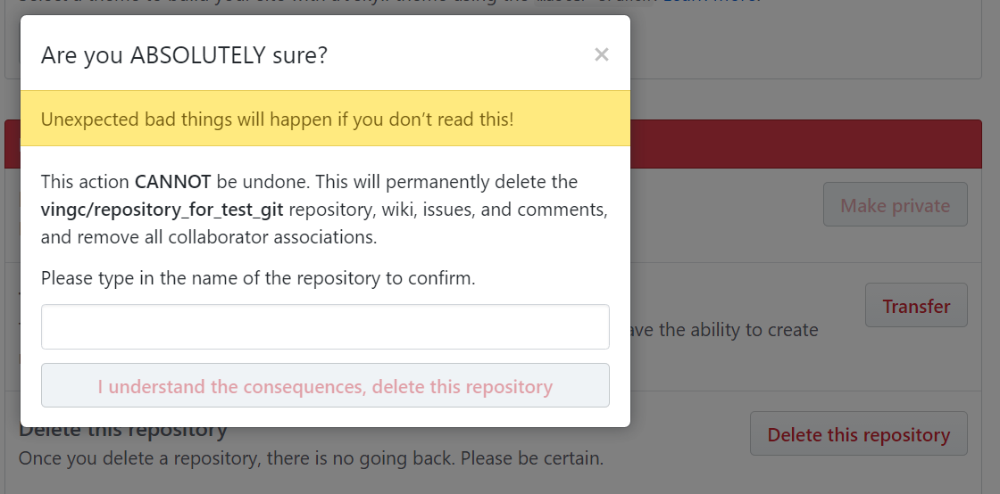

---

title: thinking from AWS and GITLAB operation incident
date: 2017-03-06 16:42:41
tags: operation
categories: technology

---

------

#### Look Back

GITLAB

On 2017/01/31, 

- one engineer deleted the production database by running the command in production context, though his purpose was to remove the database in backup context.
- take long time to recover the data from backup for useless backup mechanism.

[detail: blog of GITLAB](https://about.gitlab.com/2017/02/01/gitlab-dot-com-database-incident/)

AWS

On 2017/02/28, 

- one engineer deleted a larger set of S3 server3 than expected by typing a wrong parameter of the inputs to the command. 
- take unexpected long time to restore the whole S3 service for massive data.

[detail: announcement of AWS](https://aws.amazon.com/cn/message/41926/)

#### Thinking

There are common factors in these two incidents derived from different causes.

##### The first, operator factor.

They all typed critical operational commands in terminal, which means that the results of operations depend on people's vigor,mind,mood,emotion, and office environment,flavor of coffee,Trump's newest tweet,date of yester night...

Too many elements can affect Human, which let us make mistakes, as Murphy's Law (Anything that can go wrong will go wrong).

More inputs by operator, more possibility of error.

We can reduce the possibility of error by reduce the operator factor in workflow.

How?

* DevOps
* Automation system
* Workflow standardization
* Design principles
* container
* Others

List some examples. 

A button of Automation system to remove server or database is better than a command need be input. A button only needs to be clicked once by mouse, but a command usually needs to be input by typing tens of different keys on keyboard. Furthermore, we can make double-check by popping up a dialog when button is clicked, meanwhile popup can slow the actions of emergency operations, give operator more time and another chance to think and confirm, decrease the possibility of error. Speed is not our first objective, accuracy is. 

See how GITHUB does:

Looked at another way, Automation system can limit unexpected operations. For example, When operator is removing the database, the system checks the service firstly, when it finds out that there is business data being transited between the database and the business service system, the automation system can reject this operation which can disrupt the online service.

_People always make mistakes, but machine not. Trust system, not operator._

##### The second, backup factor.

In front two events, backup and recovery mechanism didn't work as expected. In Software Engineering, if a software doesn't work as expected, there must be something wrong to be fixed or tuned.

I don't talk about my thought of the backup mechanism, just list others':

* [GITLAB issue](https://gitlab.com/gitlab-com/infrastructure/issues/1102)
* [Comment of HaoChen](https://gitlab.com/gitlab-com/www-gitlab-com/issues/1108)

Summary:

- Automated testing of recovering [PostgreSQL database] backups
- HA design, high available distribution system

#### Last words

I was surprised and moved by the way GITLAB dealing with the incident, loyal to the truth and transparency. As a Chinese who has been deceived and duped for many years by Chinese government and Chinese media and Chinese companies, the transparency is a beam of clear light to my life.

黑夜給了我黑色的眼睛／我卻用它尋找光明

--Darkness gives me a pair of black eyes , while I use them to look for brightness.